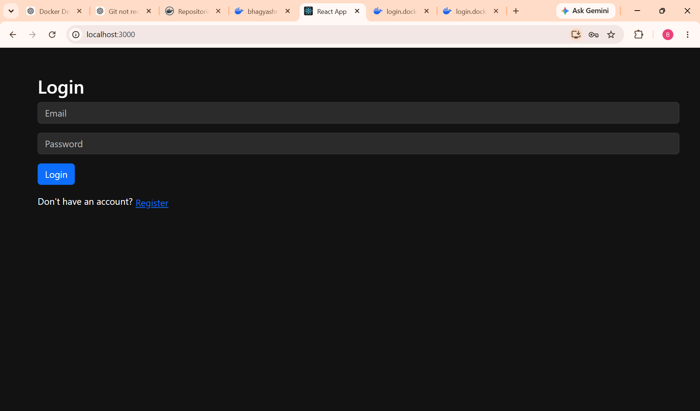
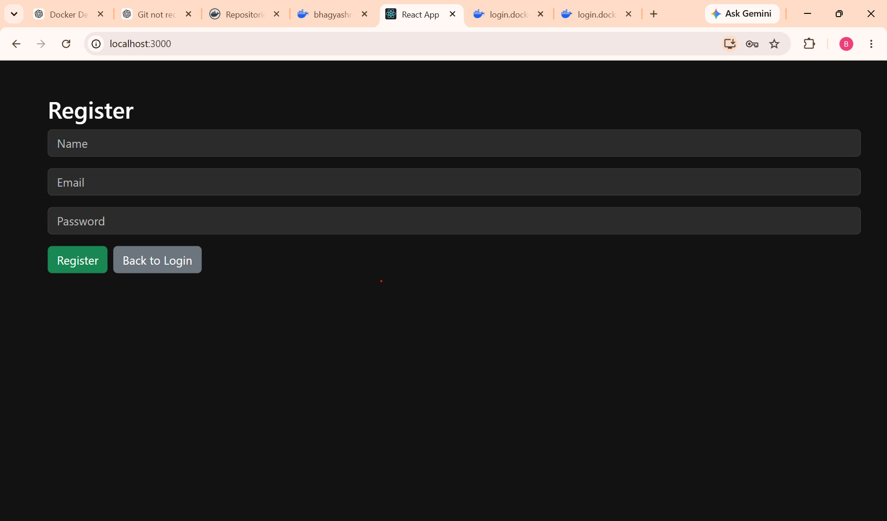
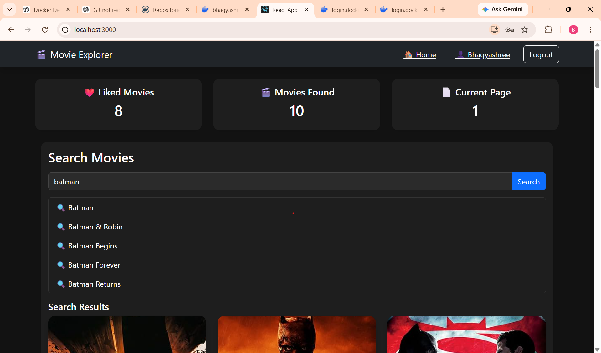
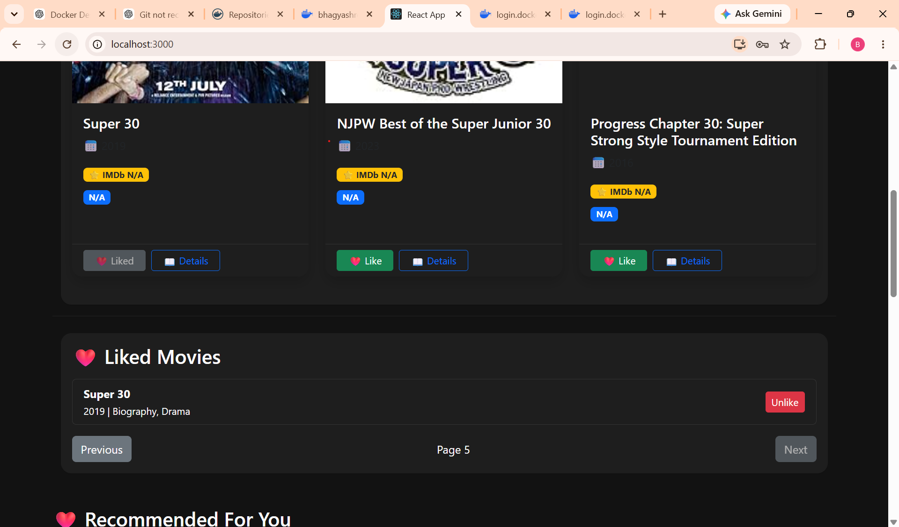
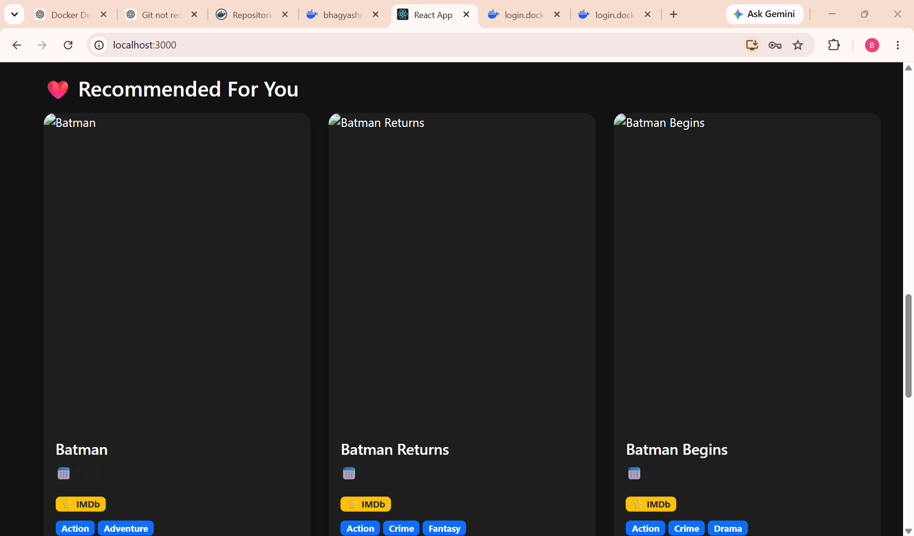
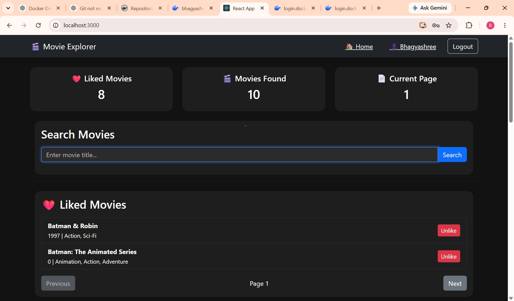
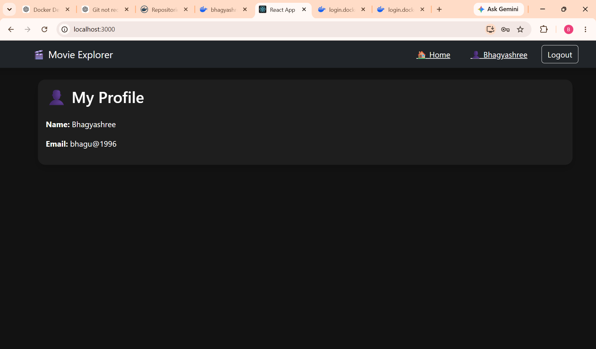
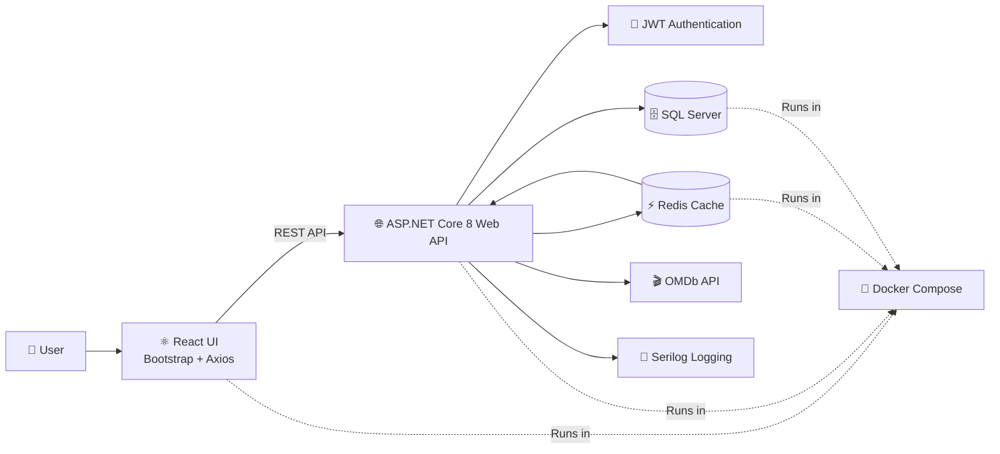

## 🌐 Live Demo

Frontend:
https://your-ui-url

Swagger:
https://your-api-url/swagger

Docker Images:
https://hub.docker.com/u/bhagyashreeb03

---

# 🎬 MovieExplorer

MovieExplorer is a full-stack movie exploration application built with **ASP.NET Core 8**, **React**, **SQL Server**, **Redis**, and **Docker**.

Users can search movies from the OMDb API, like/unlike movies, view recommendations, and securely authenticate using JWT.

---

## 📂 Project Structure (Enterprise Ready)

The project follows a tiered monolithic structure to separate concerns and ensure high maintainability:

- **`MovieExplorer.API/Core/`**: The heart of the app (Models, Interfaces).
- **`MovieExplorer.API/Application/`**: The business logic (Services, DTOs).
- **`MovieExplorer.API/Infrastructure/`**: The technical data layer (DbContext, Repos, Migrations).

---

## 📖 Project Guides

- **[🍎 macOS Setup Guide](./mac/README.md)**: How to run the project locally with Docker.
- **[🚀 Features & Roadmap](./features/README.md)**: What this API currently does and what's next.

---

# 📸 Screenshots

> ## 🔐 Authentication

<p align="center">
  
  
</p>

---

## 🎬 Movie Search

<p align="center">
  
</p>

---

## ❤️ Liked Movies & Recommendations

<p align="center">
  
  
</p>

---

## 📊 Dashboard & Profile

<p align="center">
  
  
</p>

---

- Login
- Register
- Dashboard
- Search Movies or Home page
- Movie Details
- Liked Movies
- Recommendations

---

# 🚀 Features

### Authentication
- User Registration
- User Login
- JWT Authentication
- Profile Page

### Movie Search
- Search movies using OMDb API
- Auto Suggestions
- Pagination
- Movie Details
- IMDb Rating
- Poster Display

### Liked Movies
- Like Movie
- Unlike Movie
- Pagination
- Prevent Duplicate Likes

### Recommendations
- Genre-based Movie Recommendations

### Performance
- Redis Caching
- Logging with Serilog
- Global Exception Handling

---

# 🏗️ Architecture

```
React UI
     │
Axios
     │
ASP.NET Core API
     │
Business Layer
     │
Repository Layer
     │
SQL Server
     │
Redis Cache
     │
OMDb API
```
---
## 🧰 Technology Stack

| Layer | Technology |
|--------|------------|
| Frontend | React, Bootstrap, Axios |
| Backend | ASP.NET Core 8 Web API |
| Authentication | JWT Bearer |
| ORM | Entity Framework Core |
| Database | SQL Server |
| Caching | Redis |
| External API | OMDb API |
| Logging | Serilog |
| Containerization | Docker, Docker Compose |
| Version Control | Git, GitHub |

---

## 🏗️ System Architecture

### Architecture Overview

1. The user interacts with the React application.
2. React communicates with the ASP.NET Core Web API using REST endpoints.
3. JWT Authentication secures protected APIs.
4. Frequently accessed movie data is cached in Redis to improve performance.
5. User information, likes, and application data are stored in SQL Server.
6. Movie search and details are fetched from the OMDb API.
7. Serilog captures application logs.
8. All services are containerized and orchestrated using Docker Compose.



---

# 🛠 Tech Stack

## Backend

- ASP.NET Core 8
- Entity Framework Core
- SQL Server
- JWT Authentication
- Serilog
- Redis
- Docker

## Frontend

- React
- Bootstrap
- Axios
- React Toastify

## DevOps

- Docker
- Docker Compose
- Docker Hub
- Git
- GitHub

---

# 📂 Project Structure

```
MovieExplorer
│
├── MovieExplorer.API
│   ├── Application
│   ├── Core
│   ├── Infrastructure
│   ├── Controllers
│   └── Dockerfile
│
├── movie-explorer-ui
│   ├── src
│   ├── public
│   └── Dockerfile
│
├── MovieExplorer.Tests
│
├── docker-compose.yml
│
└── README.md
```

---

# 🔐 Authentication

JWT Bearer Authentication is implemented.

Protected APIs require:

```
Authorization: Bearer <token>
```

---

# 🐳 Docker

## Build

```bash
docker compose build
```

## Run

```bash
docker compose up -d
```

Application URLs

| Application | URL |
|-------------|-----|
| React UI | http://localhost:3000 |
| API | http://localhost:7176/swagger |
| SQL Server | localhost:1433 |
| Redis | localhost:6379 |

---

# ⚙ Environment Variables

Create a `.env` file:

```text
SA_PASSWORD=<YOUR_SQL_SERVER_PASSWORD>
MSSQL_DB=MovieExplorerDB
ASPNETCORE_ENVIRONMENT=Development
REDIS_CONNECTION=redis:6379
```

---

# 📦 Docker Images

API

```
bhagyashreeb03/movieexplorer-api:1.0
```

UI

```
bhagyashreeb03/movieexplorer-ui:1.0
```

---

# 📊 API Endpoints

## Authentication

- POST /api/auth/register
- POST /api/auth/login

## Movies

- GET /api/movies/search
- GET /api/movies/details/{id}
- GET /api/movies/suggestions

## Likes

- POST /api/likes
- DELETE /api/likes/{movieId}
- GET /api/likes

## Recommendations

- GET /api/recommendations

---

# 🚀 Future Enhancements

- Azure Deployment
- GitHub Actions CI/CD
- Unit Testing
- Integration Testing
- Refresh Tokens
- Role-Based Authorization
- Elasticsearch
- Kubernetes
- Monitoring with Application Insights

---

# 👩‍💻 Author

**Bhagyashree Bhavsar**

GitHub:
https://github.com/<your-github-username>

LinkedIn:
https://www.linkedin.com/in/<your-linkedin-profile>

---

# ⭐ If you like this project

Please consider giving it a ⭐ on GitHub.